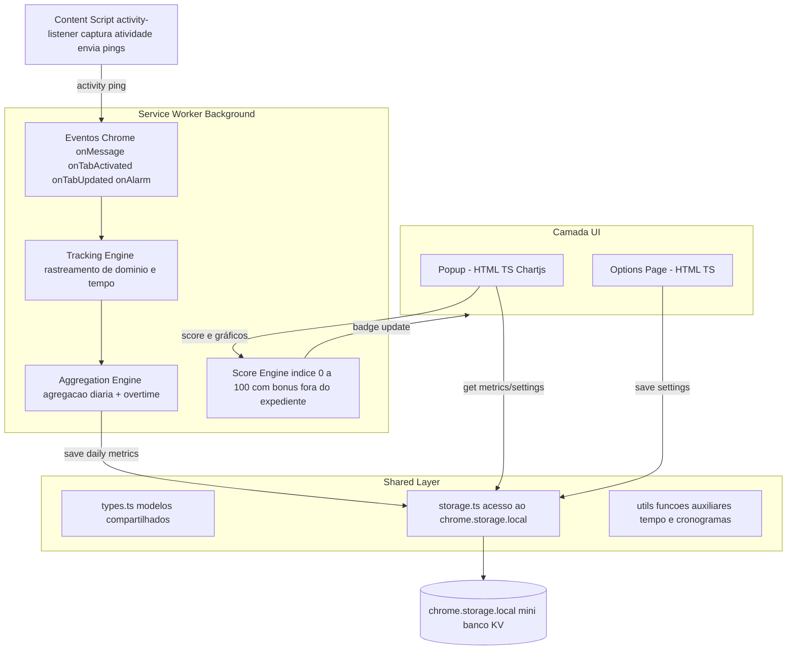

# Saul Goodman — Extensão anti-procrastinação


[](https://donotavio.github.io/saul_goodman/)
[](https://chromewebstore.google.com/detail/saul-goodman/fllkkpfaajgppbnlfoebeendceckcffe)
[](https://marketplace.visualstudio.com/items?itemName=Donotavio.saul-goodman-vscode)


Extensão MV3 para Chrome/Chromium que assume o alter ego vendedor de Saul Goodman para monitorar quanto tempo você passa em sites produtivos versus procrastinatórios. Os scripts em TypeScript acompanham domínios, inatividade, trocas frenéticas de abas e calculam um Índice de Procrastinação (0–100) exibido no badge e no popup com gráficos e mensagens sarcásticas.

## Funcionalidades principais

- **Service Worker** monitora domínio ativo, soma tempo produtivo x procrastinação, detecta inatividade e conta troca de abas.
- **Content script** envia pings de atividade (mouse/teclado/scroll) para o background não marcar você como ausente antes da hora.
- **Popup** mostra índice atual, gráfico Chart.js (produtivo vs procrastinação), resumo diário, top 5 domínios e botões de ação.
- **Options page** permite ajustar pesos do cálculo, threshold de inatividade, listas de domínios produtivos/vilões, limiar do "modo terremoto", idioma da interface (auto + 13 idiomas suportados) e definir o seu horário de trabalho (minutos produtivos fora desse período contam em dobro).
- **Classificação automática local (opt-in)**: ao visitar um domínio não classificado, a extensão sugere produtivo/procrastinador/neutro usando apenas metadados da página (title, description, keywords, og:type, presença de vídeo/scroll infinito). Nada sai do navegador; é possível ignorar por tempo configurável ou aceitar direto no popup/report. Quando você aceita/recusa e edita as listas, o modelo local aprende com esses sinais (domínio, host base, palavras e flags de vídeo/scroll) para ajustar futuras sugestões — tudo persistido apenas no `chrome.storage.local`.
- **Teste de conexão com SaulDaemon** direto nas opções: valida URL, pairing key e exibe sessões/minutos do dia.
- **Badge em tempo real** sempre exibindo o índice atual arredondado.
- **Indicadores extras**: foco ativo, elasticidade de abas por hora, tempo ocioso %, razão Prod x Proc e vilões/campeões do dia calculados on-the-fly.
- **Tooltips educativos**: cada métrica possui um ícone de informação que explica como o número foi calculado.
- **Storytelling IA**: configure sua chave OpenAI nas opções para gerar narrativas sarcásticas no relatório em tom Saul Goodman.
- **Exportação**: o usuário pode baixar um CSV completo, gerar o PDF do popup ou abrir o **Relatório detalhado** (nova página com storytelling horário, gráfico de trocas de abas por hora e PDF próprio).
- **Personalidade Saul Goodman**: mensagens e microcopy localizáveis (pt-BR por padrão, en-US/es-419 via `_locales/`) com tom sarcástico sem referências visuais protegidas.
- **Modo terremoto**: ao atingir o limiar configurável (padrão 90) o popup treme como um pager desesperado, exibe um overlay do Saul com contador regressivo e CTA para relatório/opções; a sirene opcional é configurada nas opções e apenas abas não productivas (procrastinação/indefinidas) recebem o travamento/alerta, permitindo que o usuário continue usando abas classificadas como produtivas para recuperar o foco.
- **Integração opcional com VS Code**: um daemon local (`saul-daemon`) recebe batimentos da extensão VS Code e entrega resumo diário (tempo ativo, sessões, switches/hora, timeline). O background do Chrome consome esses dados como tempo produtivo adicional — nada sai do `localhost`.

## Stack e arquitetura

- **Manifest V3** com service worker modular e ES Modules.
- **TypeScript** compilado via `tsc` para `dist/` (sem bundler adicional).
- **Chart.js** vendorizado (UMD local em `src/vendor/chart.umd.js`).
- **chrome.storage.local** para métricas diárias e configurações.
- **Sem frameworks**: todo HTML/CSS escrito manualmente.
- **Permissões extras**: `idle` (ociosidade nativa), `windows` (detectar foco do navegador), `webNavigation` (rotas em SPA), `sessions` (itens fechados recentes), `declarativeNetRequest` (bloqueio opcional dos vilões) e `notifications` (avisar sobre novidades). Os hosts `https://date.nager.at/*`, `https://api.openai.com/*`, `http://127.0.0.1/*` e `http://localhost/*` aparecem apenas quando você ativa feriados automáticos, storytelling IA ou a integração com o SaulDaemon — todos opcionais.

```text
saul_goodman/
├─ manifest.json
├─ src/img/
│  ├─ logotipo_saul_goodman.png
│  └─ logotipo_saul_goodman.ico
├─ src/vendor/
│  ├─ chart.umd.js
│  └─ jspdf.umd.min.js
├─ package.json / tsconfig.json
├─ src/
│  ├─ background/index.ts
│  ├─ content/activity-listener.ts
│  ├─ popup/
│  │  ├─ popup.html / popup.css / popup.ts
│  ├─ options/
│  │  ├─ options.html / options.css / options.ts
│  └─ shared/
│     ├─ types.ts
│     ├─ storage.ts / score.ts / metrics.ts / tab-switch.ts
│     └─ utils/{time,domain,inactivity}.ts
├─ src/vendor/chart.umd.js
├─ dist/ (gerado pelo TypeScript)
├─ site/
│  ├─ index.html / style.css / main.js
│  └─ assets/logotipo_saul_goodman.png
└─ docs/
   ├─ architecture.md
   ├─ ux-and-copy.md
   └─ indicators.md
```

## Pré-requisitos

- Node.js 18+
- Chrome/Chromium baseado em Manifest V3

## Como rodar

1. Instale dependências e gere os JS:

   ```bash
   npm install
   npm run build   # ou npm run watch para rebuild automático
   ```

2. (Opcional) Abra as Configurações do Escritório e informe sua chave `sk-...` da OpenAI para habilitar a narrativa.
3. Carregue a extensão:
   - Abra `chrome://extensions`
   - Ative "Modo do desenvolvedor"
   - Clique em **Carregar sem compactação** e selecione a pasta `saul_goodman`
4. Fixe o ícone na barra e abra o popup para validar o gráfico e o badge.

### Integração VS Code + SaulDaemon (opcional)

- Gere a **chave de pareamento** na página de opções (botão “Gerar chave”); ela fica em `ExtensionSettings.vscodePairingKey`.
- Suba o **daemon local** (Node puro, CJS):

  ```bash
  PAIRING_KEY=<sua-chave> PORT=3123 node saul-daemon/index.cjs
  ```

  Ele grava `saul-daemon/data/vscode-usage.json` e expõe `http://127.0.0.1:PORT/v1/tracking/vscode/summary`.

- Instale a **extensão VS Code** (`vscode-extension/`):
  - Gere um `.vsix` com `npm install && npm run build && vsce package` (ou instale pela Marketplace quando publicada).
  - Use o comando **Saul Goodman: preparar comando do SaulDaemon** para preencher o terminal com o start (port/chave) em modo não bloqueante.
  - Configure a mesma chave/porta da options page; o daemon e o Chrome nunca enviam dados para fora.
  - O botão **“Testar conexão”** nas opções chama `/health` e `/v1/tracking/vscode/summary` para confirmar URL/key e retorna sessões/minutos do dia.

Quando habilitada em Options, a integração soma `vscodeActiveMs` ao tempo produtivo, inclui `vscodeSessions`, trocas por hora de VS Code no gráfico de abas e mistura a timeline do editor na narrativa do relatório.

- A extensão VS Code exibe o **Índice do Saul** diretamente na barra de status (atualizado a cada minuto via SaulDaemon) e alerta quando o daemon está offline.
- Mensagens da extensão VS Code estão localizadas (`pt-BR`, `en-US`, `es-419`) e podem ser forçadas via configuração `saulGoodman.language` (padrão: seguir o idioma do VS Code).

## Fluxo de desenvolvimento

- **Editar TypeScript:** os arquivos em `src/**.ts` compilam para `dist/`. Sempre rode `npm run build` ou `npm test` (que já compila) após ajustar lógica.
- **Popup/Options HTML & CSS:** vivem em `src/popup` e `src/options`. Não precisam de build além do TypeScript.
- **Vendor:** se atualizar o Chart.js local, substitua `src/vendor/chart.umd.js` (e mantenha o manifesto sem CSP extra).

## Empacotar para a Chrome Web Store

1. Gere os artefatos: `npm install && npm run build`.
2. Monte o pacote limpo: `npm run package:webstore` (cria `release/saul-goodman-<versao>-webstore/` sem `site/`, `docs/` ou ferramentas).
3. Compacte: `cd release && zip -r saul-goodman-<versao>-webstore.zip saul-goodman-<versao>-webstore`.
4. Envie esse zip para a loja. Não compacte o diretório raiz: ele contém o site estático com scripts CDN (Google Fonts/GTM) e outros assets de marketing que acionam a regra de **código hospedado remotamente** do Manifest V3.

## Internacionalização (i18n)

A extensão e o site suportam **13 idiomas**:

- **pt-BR** (Português Brasil) — idioma base
- **en-US** (English) — idioma de fallback
- **es-419** (Español)
- **fr** (Français)
- **de** (Deutsch)
- **it** (Italiano)
- **tr** (Türkçe)
- **zh-CN** (中文)
- **hi** (हिन्दी)
- **ar** (العربية) — RTL
- **bn** (বাংলা)
- **ru** (Русский)
- **ur** (اردو) — RTL

### Estrutura de tradução

- **Extensão:** Todas as strings estão em `_locales/<locale_dir>/messages.json` (formato Chrome i18n)
- **Site/Blog:** Cópia sincronizada em `site/_locales/` e `site/blog/_locales/` via `npm run i18n:copy-site`
- **RTL automático:** Idiomas árabe (`ar`) e urdu (`ur`) aplicam `dir="rtl"` automaticamente
- **Fallback:** Todas as traduções usam `en-US` como fallback quando chave não existe

### Blog i18n — Estratégia de fallback

**Conteúdo disponível:**

- ✅ **pt-BR, en-US, es-419:** Posts completos traduzidos
- ⚠️ **Demais idiomas (fr, de, it, tr, zh-CN, hi, ar, bn, ru, ur):**
  - Interface traduzida (categorias, navegação, labels)
  - Posts em **inglês** (fallback para `en-US`)
  - Mapeamento em `src/popup/popup.ts` linha 135-148

**Roadmap:** Tradução automática de posts via content engine planejada para Q2 2026.

### Scripts de i18n

```bash
npm run i18n:check          # Valida chaves ausentes, placeholders e tamanhos
npm run i18n:copy-site      # Sincroniza _locales/ → site/_locales/
npm run i18n:stubs          # Gera stubs para novos idiomas
npm run i18n:repair-locale  # Repara locale com LLM (requer LLM_API_KEY)
```

### Resolução de locale

A função `resolveLocale()` em `src/shared/i18n.ts`:

1. Respeita preferência explícita do usuário
2. Mapeia variantes regionais (ex: `pt` → `pt-BR`, `zh` → `zh-CN`)
3. Fallback para `en-US` em idiomas não suportados
4. Detecta idioma do navegador via `chrome.i18n.getUILanguage()`

## Blog e content engine

- Blog público em `site/blog/` (home, categorias e posts estáticos em `posts/YYYY/<slug>/`), posts Markdown em `site/blog/posts/YYYY/*.md` com frontmatter (title, date, category, tags, excerpt, source_*); índice JSON para consumo em `site/blog/index.json`.
- Após adicionar/editar posts manualmente, rode `npm run blog:index` (aceita `-- --dry-run`) para regenerar `site/blog/index.json`, os posts estáticos e o RSS.
- O popup da extensão consome esse índice (URLs limpas de posts), detecta a categoria com base nas métricas do dia e sugere um artigo (com botão direto para o blog) sem depender de atualizações da Chrome Web Store.
- Para controlar a arte exibida no blog/popup, adicione `tone` no frontmatter (`incredulo`, `like` ou `nao-corte`). Quando ausente, o frontend usa heurísticas (tags/texto) para escolher a imagem que melhor representa o tom.
- Interface do blog segue o seletor PT/EN/ES do site: detecta o idioma do navegador/localStorage e atualiza hero, navegação e chips; usuários podem trocar pelo `<select>` presente em todas as páginas.
- Cada artigo inclui traduções EN/ES geradas automaticamente: frontmatter expõe `title_<lang>`/`excerpt_<lang>` e o corpo contém blocos `<!--lang:xx-->` que o frontend escolhe conforme o idioma atual.
- RSS público em `site/blog/rss.xml` e URLs no `site/sitemap.xml` para indexação.
- Execução manual: `npm run content:engine` (ou `npm run content:engine:dry-run` para não gravar) com `LLM_API_KEY` definido e opcionais `LLM_BASE_URL`/`LLM_MODEL`/`LLM_PROVIDER`. O script gera slug `YYYY-MM-DD-<slug>`, atualiza o índice e registra a fonte em `tools/content_engine/state/posted.json` para evitar duplicidade.
- Feeds/keywords configuráveis em `tools/content_engine/sources.json` (janela padrão 14 dias). Sem item relevante ou score baixo, nada é publicado.
- Automação: `.github/workflows/blog-content-engine.yml` roda às segundas 08:00 BRT e via `workflow_dispatch`, instala deps, roda o content engine e commita mudanças com `chore(blog): publish weekly article` usando `GITHUB_TOKEN` (contents: write).
- Layout do blog: ajuste `site/blog/*.html` e `site/blog/blog.css`; mantenha ao menos um post seed para validar o rendering local.

## Métricas & índice

- `DailyMetrics` agrupa tempos produtivos, procrastinação, inatividade, domínio detalhado, trocas de abas (com breakdown Prod⇄Proc⇄Neutro) e minutos produtivos fora do expediente configurado.
- `score.ts` converte esses números em um índice ponderado (pesos configuráveis nas opções). Cada minuto produtivo fora dos horários cadastrados entra com peso dobrado no cálculo.
- Indicadores adicionais no relatório: tempo com áudio em domínios procrastinatórios, minutos com navegador em segundo plano, contagem de rotas em SPA, tempo em abas agrupadas e itens fechados no dia.
- Reset automático diariamente via alarme de meia-noite; para “zerar” manualmente basta usar o DevTools → Application → Storage (não há mais botão dedicado no popup).

## Privacidade

Todo o rastreamento acontece **apenas** no Chrome do usuário. Nenhum dado sai do `chrome.storage.local` por padrão. Três fluxos opcionais fazem chamadas adicionais:

- **Narrativa IA**: se você informar uma chave da OpenAI nas opções, o relatório detalhado envia um resumo diário (índice, métricas agregadas, top domínios e trechos da timeline) para a API da OpenAI apenas para compor o texto sarcástico.
- **Feriados automáticos**: ao ativar a opção e informar o código ISO do país, o background consulta o endpoint público [Nager.Date](https://date.nager.at) para baixar a lista anual de feriados; o cache fica salvo localmente por até 7 dias.
- **Integração VS Code**: quando habilitada, o background conversa com o SaulDaemon rodando em `http://127.0.0.1:3123` para sincronizar minutos produtivos extras — tudo permanece no `localhost`.

Preferências locais (como o alerta sonoro do modo terremoto, listas de domínios e fairness) continuam apenas no navegador. O README e os docs explicam claramente o que é medido e como alterar listas/pesos.

## Documentação complementar

- [`docs/architecture.md`](docs/architecture.md): detalha o fluxo do background, content script, storage e cálculo do índice.
- [`docs/ux-and-copy.md`](docs/ux-and-copy.md): guia de experiência, tom de voz e expectativas para popup/options/report.
- [`docs/indicators.md`](docs/indicators.md): descrição formal do índice de procrastinação, métricas base, buckets horários e KPIs usados no popup, relatório, CSV e PDFs.
- Exportações estão disponíveis no popup em “Defenda seu foco” (CSV/PDF rápido) e na página `src/report/report.html`, acessível pelo botão “Abrir relatório”. Lá existe outro PDF completo com storytelling do dia.
- **Assets**: logotipo oficial em PNG/ICO dentro de `src/img/`, já referenciado pelo manifest/action.
- **VS Code & Daemon**: `saul-daemon/` mantém o backend local e `vscode-extension/` envia os batimentos. As três versões (Chrome, daemon e VS Code) são sincronizadas pelo workflow `.github/workflows/version-bump.yml`.



Contribuições futuras podem seguir o estilo modular existente e manter o humor ágil de Saul — sempre deixando claro o que é rastreado e mantendo todo o processamento local.
